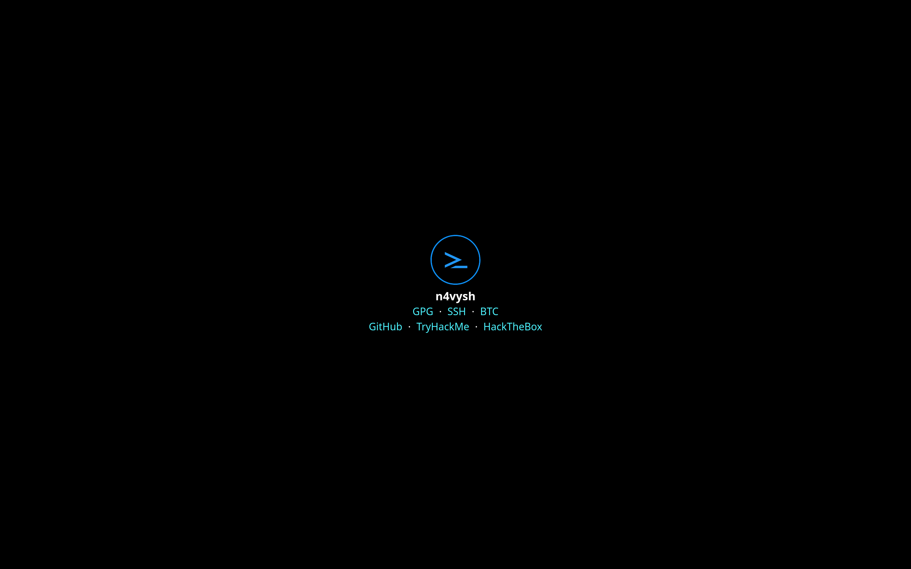

# n4vysh.dev

This repository contains the source code of the website to show technical
skillsets and expertise.

| Clearnet             | Darknet                                                                  |
| :------------------- | :----------------------------------------------------------------------- |
| <https://n4vysh.dev> | <https://xdd456duxxh47o3uxu2ql3lj76i6e7paofm7shfts2p6gavqbvngfpqd.onion> |

## Features

- Immutable infrastructure with [Docker][docker-link]
- Infrastructure as Code with [Terraform][terraform-link] and [Terragrunt][terragrunt-link]
- Policy as Code with [Rego][rego-link]
- CIOps with [GitHub Actions][github-actions-link]
- DevSecOps with [terrascan][terrascan-link], [Trivy][trivy-link] and
  [checkov][checkov-link]
- Detect Configuration drift with [driftctl][driftctl-link]

[docker-link]: https://www.docker.com/
[terraform-link]: https://www.terraform.io/
[terragrunt-link]: https://terragrunt.gruntwork.io/
[rego-link]: https://www.openpolicyagent.org/docs/latest/policy-language/
[github-actions-link]: https://github.com/features/actions
[terrascan-link]: https://runterrascan.io/
[trivy-link]: https://aquasecurity.github.io/trivy/
[checkov-link]: https://www.checkov.io/
[driftctl-link]: https://driftctl.com/

## Website specifications

### Common

- Static Site Generation with [Next.js][nextjs-link]

[nextjs-link]: https://nextjs.org/

### Clearnet

- Score 100% on [Google PageSpeed Insights][pagespeed-insights-link]
- Support [Onion-Location][onion-location-link] header
- Deploy with [Vercel][vercel-link]

[pagespeed-insights-link]: https://pagespeed.web.dev/analysis/https-n4vysh-dev/kybbgkr02d
[onion-location-link]: https://community.torproject.org/onion-services/advanced/onion-location/
[vercel-link]: https://vercel.com/

### Darknet

- Run [Nginx][nginx-link] and [tor][tor-link] as unprivileged user
- Run [Onion Services][onion-service-link] over [Unix sockets][unix-socket-link]
  and [s6-overlay][s6-overlay-link]
- Deploy with [Fly.io][flyio-link]

[nginx-link]: https://www.nginx.com/
[tor-link]: https://www.torproject.org/
[onion-service-link]: https://community.torproject.org/onion-services/
[unix-socket-link]: https://en.wikipedia.org/wiki/Unix_domain_socket
[s6-overlay-link]: https://github.com/just-containers/s6-overlay
[flyio-link]: https://fly.io/

## Requirements

Need Linux (64-bit) machine and following tools.

| Name                  | Description             | Version     |
| :-------------------- | :---------------------- | :---------- |
| [direnv][direnv-link] | Shell extension         | ~> 2.32.3   |
| [devbox][devbox-link] | Version manager         | ~> 0.8.2    |
| [Docker][docker-link] | Virtualization software | ~> 20.10.14 |

Suggest use Editor or IDE that supports [EditorConfig][editorconfig-link],
[LSP][lsp-link], formatter, and linter. For windows or macos user, suggest use
[WSL][wsl-link] or [Lima][lima-link]. Probably it works.

[direnv-link]: https://direnv.net/
[devbox-link]: https://www.jetpack.io/devbox
[wsl-link]: https://docs.microsoft.com/en-us/windows/wsl/
[lima-link]: https://github.com/lima-vm/lima
[editorconfig-link]: https://editorconfig.org/
[lsp-link]: https://microsoft.github.io/language-server-protocol/

## Development setup

Preview and edit the website on local machine as follows:

1. [Download binary of direnv with system package manager][direnv-download-link]
1. [Setup shell hook of direnv][direnv-hook-link]
1. [Setup Nix for devbox][nix-install-link]
1. [Download binary of devbox][devbox-install-link]
1. [Download docker client and start docker daemon][docker-install-link]
1. [Download git client with system package manager][git-install-link]
1. [Clone this repository on local machine][gh-clone-link]
1. Go to the project root directory of this repository in terminal
1. Run [`./scripts/install-packages.bash`][script-link] to install packages via
   devbox and [rtx][rtx-link]

frontend - clearnet:

1. Run `cd frontend/` to change frontend directory
2. Run `pnpm dev` to start the server of Next.js in `development` mode
3. Open <http://localhost:3000/> in browser
4. After done with the preview, press Ctrl-C in terminal to stop the server

While the preview is running, edit tsx and css files and automatically rebuild
them. Suggest IDE or editor setup with [TypeScript Language Server][tsserver-link]
and [eslint][eslint-link] installed by [pnpm][pnpm-link].

frontend - darknet:

1. Run `cd frontend/` to change frontend directory
2. Run `just` to build container image and start the server
3. Run `just url` to show onion address and open in [Tor Browser][tor-browser-link]
4. After done with the preview, press Ctrl-C in terminal to stop the server

infra:

Suggest IDE or editor setup with [terraform-ls][terraform-ls-link] and
[yamllint][yamllint-link] installed by rtx.

---

Use [Conventional Commits 1.0.0][conventional-commit-link] when create commits.

[direnv-download-link]: https://direnv.net/docs/installation.html
[direnv-hook-link]: https://direnv.net/docs/hook.html
[nix-install-link]: https://nixos.org/download.html
[devbox-install-link]: https://www.jetpack.io/devbox/docs/installing_devbox/
[docker-install-link]: https://docs.docker.com/engine/install/
[git-install-link]: https://git-scm.com/book/en/v2/Getting-Started-Installing-Git
[gh-clone-link]: https://docs.github.com/en/get-started/getting-started-with-git/about-remote-repositories
[script-link]: ./scripts/install-packages.bash
[rtx-link]: https://github.com/jdxcode/rtx
[tsserver-link]: https://github.com/typescript-language-server/typescript-language-server
[eslint-link]: https://eslint.org/
[pnpm-link]: https://pnpm.io/
[tor-browser-link]: https://www.torproject.org/download/
[terraform-ls-link]: https://github.com/hashicorp/terraform-ls
[yamllint-link]: https://github.com/adrienverge/yamllint
[conventional-commit-link]: https://www.conventionalcommits.org/en/v1.0.0/

## Test

Run `just test` to lint and format the source code with
[lefthook][lefthook-link]. lefthook run following tools.

| Name                                                                                                                                                                                                                              | Target type                   |
| :-------------------------------------------------------------------------------------------------------------------------------------------------------------------------------------------------------------------------------- | :---------------------------- |
| [eslint][eslint-link]                                                                                                                                                                                                             | js, ts, and tsx               |
| [yamllint][yamllint-link]                                                                                                                                                                                                         | YAML files                    |
| [taplo][taplo-link]                                                                                                                                                                                                               | TOML files                    |
| [just][just-link]                                                                                                                                                                                                                 | justfile                      |
| [markdownlint][markdownlint-link] + [markdown-link-check][markdown-link-check-link]                                                                                                                                               | Markdown files                |
| [vale][vale-link]                                                                                                                                                                                                                 | prose                         |
| [shfmt][shfmt-link] + [shellharden][shellharden-link] + [shellcheck][shellcheck-link]                                                                                                                                             | shell scripts                 |
| [commitlint][commitlint-link]                                                                                                                                                                                                     | commit messages               |
| [gitleaks][gitleaks-link]                                                                                                                                                                                                         | secrets                       |
| [typos][typos-link]                                                                                                                                                                                                               | misspellings                  |
| [actionlint][actionlint-link]                                                                                                                                                                                                     | GitHub Actions workflow files |
| [terraform fmt][terraform-fmt-link] + [terraform validate][terraform-validate-link] + [terrascan][terrascan-link] + [trivy][trivy-link] + [tflint][tflint-link] + [terraform-docs][terraform-docs-link] + [checkov][checkov-link] | tf files                      |
| [terragrunt hclfmt][terragrunt-hclfmt-link]                                                                                                                                                                                       | terragrunt.hcl                |

[lefthook-link]: https://github.com/evilmartians/lefthook
[taplo-link]: https://taplo.tamasfe.dev/
[just-link]: https://github.com/casey/just
[markdownlint-link]: https://github.com/DavidAnson/markdownlint
[markdown-link-check-link]: https://github.com/tcort/markdown-link-check
[vale-link]: https://github.com/errata-ai/vale
[shfmt-link]: https://github.com/mvdan/sh
[shellharden-link]: https://github.com/anordal/shellharden
[shellcheck-link]: https://www.shellcheck.net/
[commitlint-link]: https://commitlint.js.org/#/
[gitleaks-link]: https://github.com/zricethezav/gitleaks
[typos-link]: https://github.com/crate-ci/typos
[actionlint-link]: https://github.com/rhysd/actionlint
[terraform-fmt-link]: https://www.terraform.io/cli/commands/fmt
[terraform-validate-link]: https://www.terraform.io/cli/commands/validate
[tflint-link]: https://github.com/terraform-linters/tflint
[terraform-docs-link]: https://github.com/terraform-docs/terraform-docs
[terragrunt-hclfmt-link]: https://terragrunt.gruntwork.io/docs/reference/cli-options/#hclfmt

## Update

[Renovate][renovate-link] create update pull requests every 3 months
on the first day of the month.

[renovate-link]: https://renovatebot.com

## List

Run `just list` to list available commands in command runner.

## Deploy

Run `ENV=prd just deploy` to deploy server resources with Terraform and Terragrunt.
Terragrunt use following terraform modules.

| Tier      | Name                                                                                                  |
| :-------- | :---------------------------------------------------------------------------------------------------- |
| Verified  | [terraform-aws-modules/iam/aws//modules/iam-assumable-role-with-oidc][terraform-module-iam-oidc-link] |
| Verified  | [terraform-aws-modules/iam/aws//modules/iam-policy][terraform-module-iam-policy-link]                 |
| Verified  | [terraform-aws-modules/route53/aws//modules/delegation-sets][terraform-module-route53-ds-link]        |
| Verified  | [terraform-aws-modules/route53/aws//modules/records][terraform-module-route53-records-link]           |
| Verified  | [terraform-aws-modules/route53/aws//modules/zones][terraform-module-route53-zones-link]               |
| Self‐made | [aws-iam-idp](./infra/terraform/modules/aws-iam-idp/README.md)                                        |
| Self‐made | [aws-route53-dnssec](./infra/terraform/modules/aws-route53-dnssec/README.md)                          |

Self-made modules follow
[Terraform Best Practices](https://www.terraform-best-practices.com/).
Terragrunt show cost estimate with [infracost][infracost-link] and check budget
with [conftest][conftest-link] after the call to Terraform.

[infracost-link]: https://www.infracost.io/
[conftest-link]: https://www.conftest.dev/
[terraform-module-iam-oidc-link]: https://registry.terraform.io/modules/terraform-aws-modules/iam/aws/latest/submodules/iam-assumable-role-with-oidc
[terraform-module-iam-policy-link]: https://registry.terraform.io/modules/terraform-aws-modules/iam/aws/latest/submodules/iam-policy
[terraform-module-route53-ds-link]: https://registry.terraform.io/modules/terraform-aws-modules/route53/aws/latest/submodules/delegation-sets
[terraform-module-route53-records-link]: https://registry.terraform.io/modules/terraform-aws-modules/route53/aws/latest/submodules/records
[terraform-module-route53-zones-link]: https://registry.terraform.io/modules/terraform-aws-modules/route53/aws/latest/submodules/zones

## License

[Icon](./frontend/public/images/icon.svg) distributed under
the [CC-BY 4.0][cc-link]. All other files distributed under
the [Unlicense][unlicense-link]. See the [LICENSE](./LICENSE) file
and [UNLICENSE](./UNLICENSE) file for details.

[cc-link]: https://choosealicense.com/licenses/cc-by-4.0/
[unlicense-link]: https://choosealicense.com/licenses/unlicense/

<!-- markdownlint-configure-file
{
  "MD013": { "tables": false }
}
-->
